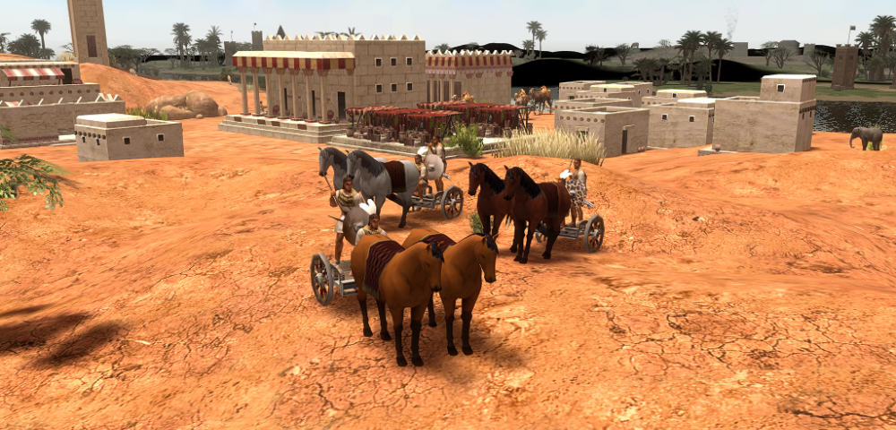

# garamantians
New crowd-sourced civ Garamantians.

> This co-developed mod for the openSorce game 0ad Empires Ascends

https://en.wikipedia.org/wiki/Garamantes

Forum Link:
https://wildfiregames.com/forum/topic/37917-civilization-garamantians-mod

### Adjustments and improvements

The project is still in development and the next updates will focus on the following tasks:

- [x] Melhoria nos modelos 3D
- [ ] Novas texturas para as unidades.

## Download

You can clone the github project to test this mod.

There is only one download option for every version, because the same mod can work across all platforms 0 A.D. can run on. This means you only need one ZIP file regardless if you are using Windows, Linux or macOS.

## Installation

See https://trac.wildfiregames.com/wiki/Modding_Guide#Howtoinstallmods

## Contributing

We could always use another helping hand with this project. There are several ways to help and contribute to the Yayoi mod:

- Download, install and play the mod.
- Promote the mod by telling friends about it, create game play videos or write a blog article about it.
- Report problems and bugs.
- Help to translate the mod in different languages.
- Be a community manager and help others.
- Create maps.
- Write news article for new releases and changes.
- Create 2D or 3D art.
- Help with research for units and buildings.
- Contribute sound.
- Help with the development.
- Test new releases and report your findings.

## 🤝 Contributors

[⬆ Voltar ao topo](#nome-do-projeto) 